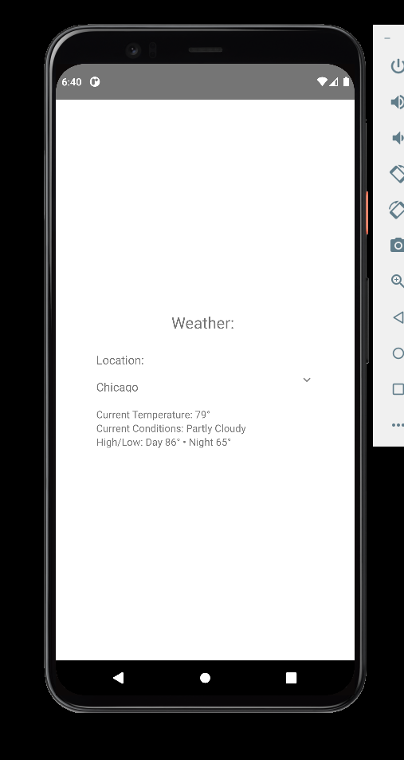

# react-native-weather

This is a project example for building a mobile app with React Native. It uses a call to weather.com in order to find the current weather conditions for a list of set locations.

## Running application

The development of this project is mostly focused on Android. To build and run the project follow these steps:

* Run npm to install dependencies
* Navigate to the android folder and run .\gradlew assembleDebug to run the debug build for Android
* Navigate back to the base directory and run npm start, then press a

## Screenshots

